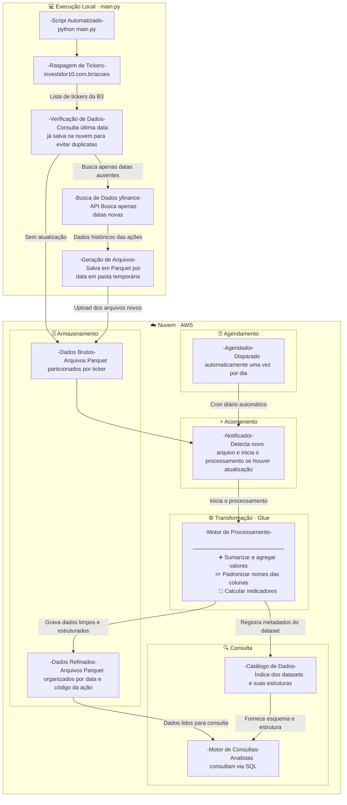

# FIAP-8MLET-TechChallenge-II

> **Pipeline Batch Bovespa: Ingestão e Arquitetura de Dados**
> Tech Challenge — Pós-Graduação Machine Learning Engineering | FIAP

---

## 📌 Descrição

Este projeto implementa um pipeline de dados completo para extração, processamento e análise de ações e índices da B3 (Bolsa de Valores do Brasil). A solução utiliza serviços gerenciados da AWS para orquestrar o fluxo de dados desde a coleta até a disponibilização para consultas analíticas via SQL.

---

## 📼 Vídeos 

Vídeo #1 (02:42) - Scrap de dados da B3 - https://drive.google.com/file/d/1iJchr6hzl_KcOYZ4AQTRw3ZBFA4cqhSy/view?usp=sharing
Vídeo #2 (05:25) - ETL dos dados na AWS - https://drive.google.com/file/d/1BWGgKZP7NKqAs2HhCzf27Jz8ME0Rogif/view?usp=sharing
Total: 08:07

---

## 🏗️ Arquitetura

### Fluxo do Pipeline

1. **Scrap**: Coleta todos os tickers disponíveis para extração a partir do investidor10.com.
2. **Extração**: Script Python coleta dados diários de ações/índices da B3 via `yfinance`.
3. **Ingestão Bruta**: Os dados são salvos no S3 em formato Parquet, particionados por data (`raw/`).
4. **Trigger Lambda**: O Lambda é disparado diariamente por um scheduler programado no EventBridge.
5. **ETL no Glue**: A Lambda dispara o job de ETL no AWS Glue, que realiza as transformações necessárias.
6. **Dados Refinados**: O resultado é salvo no S3 na pasta `refined/`, particionado por ticker.
7. **Catalogação**: O Glue Catalog registra automaticamente os metadados da tabela.
8. **Consultas Analíticas**: Os dados ficam disponíveis para consulta SQL via AWS Athena.

---

## 📁 Estrutura do Repositório

```
FIAP-8MLET-TechChallenge-II/
├── glue
│   └── fiap-8mlet-techchallenge-f2-glue-etl-refined.py
├── lambda
│   └── fiap-8mlet-techchallenge-f2-lambda.py
├── README.md
└── src
    ├── env.example
    ├── load_data_from_yfinance.py
    ├── load_to_s3.py
    ├── main.py
    └── scrap_tickers.py
```

---

## ⚙️ Tecnologias Utilizadas

| Tecnologia | Função |
|---|---|
| **Python** | Linguagem principal do projeto |
| **yfinance** | Extração de dados históricos da B3 |
| **AWS S3** | Armazenamento dos dados brutos e refinados |
| **AWS Lambda** | Trigger para acionamento automático do job Glue |
| **AWS Glue** | Job de ETL para transformação dos dados |
| **AWS Glue Catalog** | Catalogação automática dos dados refinados |
| **AWS Athena** | Consultas SQL sobre os dados refinados |
| **Apache Parquet** | Formato de armazenamento colunar otimizado |

---

## ✅ Requisitos Implementados

- **Requisito 1** — Extração de dados de ações/índices da B3 com granularidade diária.
- **Requisito 2** — Dados brutos ingeridos no S3 em formato Parquet com partição diária.
- **Requisito 3** — Bucket S3 aciona uma Lambda que por sua vez inicia o job ETL no Glue.
Nota: Eu optei por não disparar o Lambda pela inclusão de novos arquivos no S3 e sim, dispará-lo por um scheduler uma vez ao dia.
- **Requisito 4** — Função Lambda (Python) responsável exclusivamente por iniciar o job Glue.
- **Requisito 5** — Job Glue com as seguintes transformações obrigatórias:
  - **A**: Agrupamento numérico com sumarização (ex.: valor máximo e valor mínimo).
  - **B**: Renomeação de colunas existentes além das de agrupamento.
  - **C**: Cálculo baseado em data (ex.: média móvel de 20 dias do preço de fechamento).
- **Requisito 6** — Dados refinados salvos em Parquet na pasta `refined/`, particionados por data e ticker.
- **Requisito 7** — Job Glue cataloga automaticamente os dados no Glue Catalog (banco `default`).
- **Requisito 8** — Dados disponíveis para consulta SQL via AWS Athena.

---

## 🚀 Como Executar

### Pré-requisitos

- Conta AWS com permissões para S3, Lambda, Glue e Athena
- Python 3.10+
- AWS CLI configurado (`aws configure`)
- Biblioteca `yfinance` instalada

```bash
pip install yfinance pandas pyarrow boto3
```

### 1. Extração e Ingestão dos Dados Brutos

```bash
python src/extraction/main.py
```

Esse script coleta os dados diários e faz o upload para o bucket S3 no caminho:

```
s3://<seu-bucket>/raw/ticker=<TICKER>/b3_yyyymmdd.parquet
```

### 2. Configurar o Job Glue

Faça o upload do script `src/glue/techchallenge-f2-glue-etl-refined.py` no AWS Glue e configure:

- **IAM Role** com permissões para S3, Glue e Glue Catalog.
- **Caminho de entrada**: `s3://<seu-bucket>/raw/`
- **Caminho de saída**: `s3://<seu-bucket>/refined/`

### 3. Configurar a Função Lambda

Faça o deploy da função `src/lambda/techchallenge-f2-glue-etl-refined.py` na AWS Lambda. Após a configuração da Lambda, configurar o disparo no EventBridge para dispará-la.

### 4. Consultar os Dados no Athena

Após a execução do pipeline, os dados estarão disponíveis no Glue Catalog. Exemplo de consulta no Athena:

```sql
SELECT *
FROM b3_stocks.b3_refined
WHERE ticker = 'PRIO3'
ORDER BY date DESC
```

---

## 📊 Transformações do Job Glue

| Transformação | Descrição |
|---|---|
| **Agrupamento** | Cálculo do valor máximo e mínimo agrupados por ticker dos últimos 10 dias |
| **Renomeação de colunas** | `high` → `hi`, `low` → `lo` |
| **Cálculo temporal** | Média móvel de 20 dias (`ema_20d`) e VWAP (`vwap_20d`) |

---

## 📦 Estrutura de Dados no S3

```
s3://fiap-8mlet-techchallenge-f2-bkt/
├── b3_daily/
|   └── raw/
│       └── b3_yyyymmdd.parquet
└── refined/
    ├── ticker=PETR4/
    │   └── refined.parquet
    └── ticker=VALE3/
        └── refined.parquet
```

---

## 👨‍💻 Autores

Desenvolvido como parte do **Tech Challenge — Fase 2** da Pós-Graduação em **Machine Learning Engineering** da **FIAP** por Ricardo Sandrini.

---

## 📄 Licença

Este projeto é de uso acadêmico, desenvolvido para o programa de pós-graduação FIAP.
